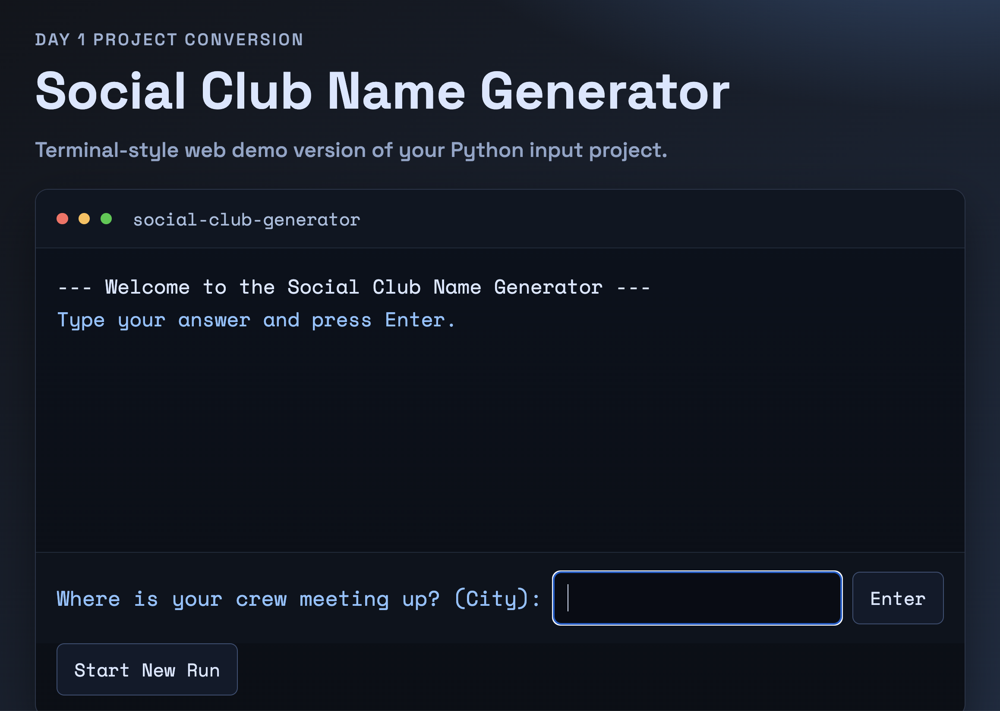

# Day 001 - Social Club Name Generator

## Overview
Python CLI project converted to a browser demo that feels like a terminal app.
Generate one random social club/team name based on city, vibe, and hobby inputs.

## Requirements
- Input: city, vibe, hobby
- Output: one recommended club name
- Core Features:
  - CLI flow with `input()` in Python
  - Terminal-style web demo with step-by-step prompts (by Codex)
  - Random recommendation from predefined naming patterns

## Tech Stack
- Python
- HTML, CSS, JavaScript (by Codex)

## Run Locally

### Python
```bash
python3 main.py
```

### Web
```bash
python3 -m http.server 8000
# Open http://localhost:8000
```

## Publish as a public GitHub repo
Recommended: make this folder its own repo root.

```bash
cd 100docp-day-001-social-club-name-generator
git init
git add .
git commit -m "Initialize Social Club Name Generator (Python + Web Demo)"
gh repo create 100docp-day-001-social-club-name-generator --public --source=. --remote=origin --push
```

## Enable GitHub Pages
1. Open your repo on GitHub.
2. Go to `Settings` -> `Pages`.
3. Under `Build and deployment`, choose:
   - `Source`: `Deploy from a branch`
   - `Branch`: `main` and `/ (root)`
4. Save, then wait about 1-2 minutes.

## Live Demo
- URL: `https://<your-username>.github.io/100docp-day-001-social-club-name-generator/`

## Repository
- URL: `https://github.com/<your-username>/100docp-day-001-social-club-name-generator`

## Project Structure
```text
.
├── LICENSE
├── README.md
├── main.py
├── index.html
├── style.css
├── app.js
└── screenshots
    └── main.png
```

## What I Learned
- How to convert a Python CLI prompt flow into browser interaction logic.
- How to exploit Codex to mimic terminal UX with HTML/CSS/JS.
- How to structure one-day project repos for repeatable shipping.

## Improvements (Next)
- Add seed-based deterministic mode for repeatable results.
- Add copy-to-clipboard and shareable result URL.

## Screenshot


## Reference
- Source curriculum: [App Brewery - 100 Days of Python](https://github.com/appbrewery/100-days-of-python)
- Day: <python-day1-demo>
- Note: Implemented independently for learning and portfolio purposes.
